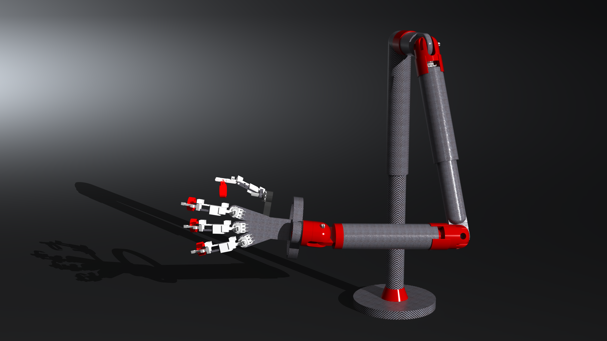
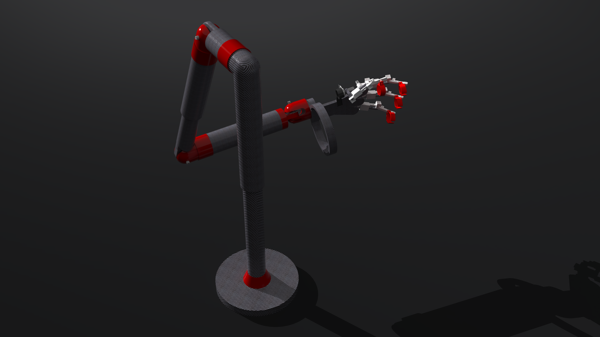
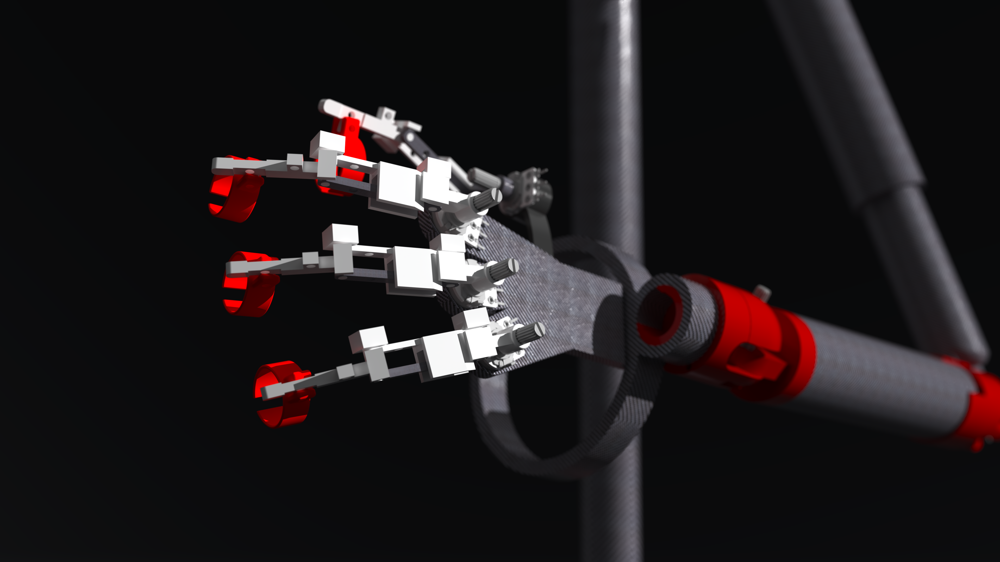
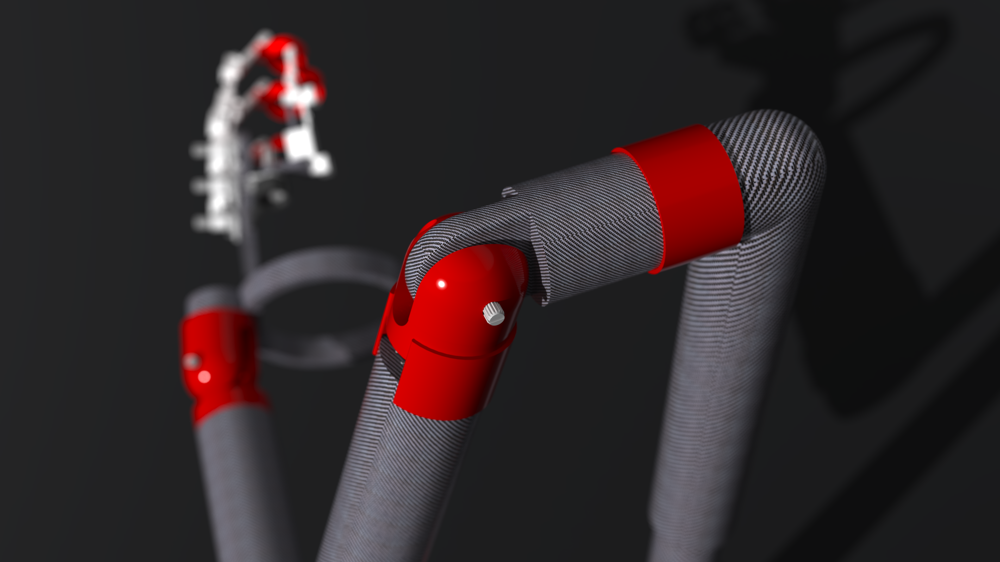

# inhabit_teleop

Teleoperation tooling for a Unitree G1 humanoid robot, driven by potentiometer inputs over serial.

## Renders

These renders show the teleoperation rig and its intended G1 workflow.

| Teleop rig overview | G1 interaction view |
| --- | --- |
|  |  |

| Controller detail | Alternate project view |
| --- | --- |
|  |  |

## Purpose

`inhabit_teleop` is a hardware-to-robot control stack for experimenting with physical teleoperation on the Unitree G1.

The core idea is:

- read live potentiometer values from an ESP32-based controller over USB serial
- map those values onto selected G1 joints with configurable gains, scaling, offsets, and limits
- publish low-level joint commands over DDS to either a real robot or the local MuJoCo simulation

The repo also includes a GUI workflow for building and testing those mappings before moving to hardware. That makes it useful both as a direct teleop bridge and as a calibration / iteration environment for custom control rigs.

This project includes:

- **Python bridge programs** that read potentiometer data from an ESP32 over serial and send joint commands to the robot via DDS
- **A GUI studio** for editing joint mappings and testing with virtual potentiometer sliders
- **ESP32-S3 firmware** for reading potentiometers (internal ADC or MCP3008 over SPI)

## Hardware notes

The physical controller build is intended to stay inexpensive, roughly in the $20 to $30 range before printing.

- Reference part link 1: https://www.amazon.com/dp/B07SJ5RZJ4?ref=ppx_yo2ov_dt_b_fed_asin_title
- Reference part link 2: https://www.amazon.com/dp/B00MCK7JMS?ref=ppx_yo2ov_dt_b_fed_asin_title&th=1
- Print material: any standard PLA should work for the arm components
- CAD source: `teleopv2.zip`

## Supported environment

The supported setup path for new users is:

- Ubuntu on a native Linux machine
- Ubuntu in WSL2 on Windows
- Ubuntu in a virtual machine on Windows

Native Windows is not currently supported. The repo assumes Linux-style device paths such as `/dev/ttyACM0` and Linux-oriented build tools.

If you are on Windows, use the Windows-specific guide in [README_windows.md](/home/matthew/projects/inhabit_teleop/README_windows.md).

## Quick start

### 1. Install system dependencies

**Ubuntu / Debian:**

```bash
sudo apt update
sudo apt install git cmake build-essential python3.12 python3.12-venv python3.12-tk
```

**Arch Linux:**

```bash
sudo pacman -S git cmake base-devel python tk
```

> Python 3.12 is recommended. The Unitree SDK and MuJoCo may not have wheels for newer Python versions yet.

### 2. Clone the repo

```bash
git clone https://github.com/matthehzhang/inhabit_teleop.git
cd inhabit_teleop
```

### 3. Create a virtual environment

```bash
python3.12 -m venv .venv
source .venv/bin/activate
pip install --upgrade pip
```

### 4. Install Python packages

```bash
pip install numpy pyserial customtkinter mujoco pygame opencv-python PyOpenGL
```

### 5. Build and install CycloneDDS

The Unitree Python SDK depends on CycloneDDS. You need to build it from source:

```bash
git clone https://github.com/eclipse-cyclonedds/cyclonedds -b releases/0.10.x
cd cyclonedds
mkdir build install
cd build
cmake .. -DCMAKE_INSTALL_PREFIX=../install
cmake --build . --target install -j$(nproc)
cd ../..
```

Set the environment variable so the Python bindings can find it:

```bash
export CYCLONEDDS_HOME="$(pwd)/cyclonedds/install"
```

To make this automatic every time you activate the venv:

```bash
echo 'export CYCLONEDDS_HOME="'"$(pwd)"'/cyclonedds/install"' >> .venv/bin/activate
```

### 6. Install the Unitree Python SDK

```bash
git clone https://github.com/unitreerobotics/unitree_sdk2_python.git
pip install -e unitree_sdk2_python/
```

### 7. Install Unitree MuJoCo for simulation

```bash
git clone https://github.com/unitreerobotics/unitree_mujoco.git
```

You need this if you want to use the simulator or virtual-pot simulation workflow. It is not required for the direct serial-to-robot bridge.

### 8. Verify everything works

```bash
source .venv/bin/activate
python -c "import unitree_sdk2py; print('unitree_sdk2py OK')"
python -c "import serial; print('pyserial OK')"
python -c "import customtkinter; print('customtkinter OK')"
python -c "import mujoco; print('mujoco OK')"
```

If all four print "OK", you're ready.

## Running the programs

Always activate the venv first:

```bash
source .venv/bin/activate
```

### Unified Studio (GUI editor + virtual pot simulator)

```bash
python programs/g1_unified_studio.py
```

This is the main GUI tool. It has two tabs:

- **Node Config** — drag-and-drop editor for joint bindings (save/load JSON projects, export Python configs)
- **Pot Simulator** — virtual potentiometer sliders that can publish to the MuJoCo sim or (with explicit arming) the real robot

### Joint Config Editor (standalone)

```bash
python programs/g1_joint_config_ui.py
```

### Virtual Pot Simulator (standalone)

```bash
python programs/g1_virtual_pot_sim.py programs/uitest1.g1config.json
```

### Bridge: serial potentiometers to robot

Connect your ESP32 via USB, then:

```bash
python programs/scratch/run_g1_bridge.py programs/scratch/g1_left_wrist_bridge_config.py /dev/ttyACM0 <network_interface>
```

Replace `<network_interface>` with the NIC connected to the robot (e.g. `enp2s0`). Find yours with `ip link`.

For the 24-channel MCP3008 variant:

```bash
python programs/run_g1_bridge_20ch.py programs/g1_POTCONFIG.py /dev/ttyACM0 <network_interface>
```

### Legacy bridge (hardcoded left-wrist config)

```bash
python programs/scratch/g1BRIDGE.py
```

## ESP32-S3 firmware

The firmware lives in `firmware/serial_test/`. It requires the [ESP-IDF toolchain](https://docs.espressif.com/projects/esp-idf/en/stable/esp32s3/get-started/).

**Original (internal ADC):**

```bash
cd firmware/serial_test
idf.py build
idf.py flash
```

**MCP3008 variant (3x MCP3008 over SPI, 20 channels):**

```bash
cd firmware/serial_test
idf.py -DFIRMWARE_VARIANT=mcp3008 build
idf.py flash
```

> Edit the SPI pin assignments in `main/main_mcp3008.c` before building.

## Project structure

```
programs/               Python bridge programs and GUI tools
firmware/serial_test/   ESP32-S3 firmware source
tools/                  Helper scripts
third_party/            Local third-party source checkouts
cyclonedds/             (gitignored) CycloneDDS build
unitree_sdk2_python/    (gitignored) Python SDK checkout
unitree_mujoco/         (gitignored) MuJoCo sim checkout
.venv/                  (gitignored) Python virtual environment
```
